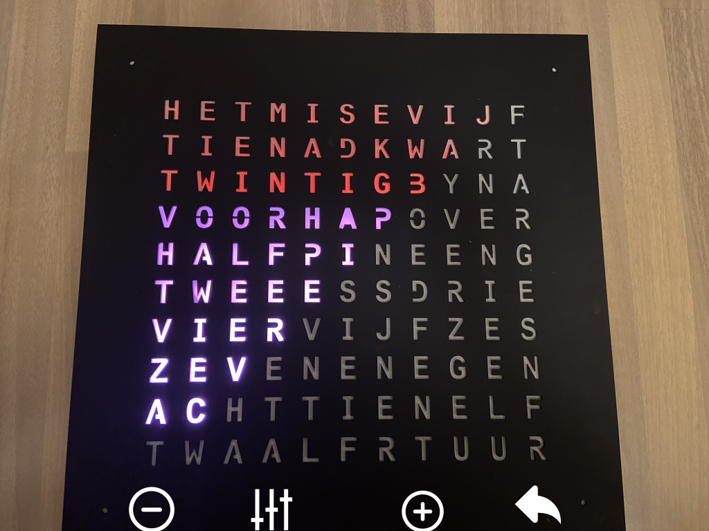

# Brightness mode

When you enter brightness mode, you see the following screen

The top row represents the minimum brightness, the bottom row represents the maximum brightness. The active row will blink.

| | |
| -- | -- |
|  | &bull; Tap to decrease minimum/maximum brightness |
|  | &bull; Tap to toggle between minimum and maximum brightness |
|  | &bull; Tap to increase minimum/maximum brightness |
|  | &bull; Hold to return to [main mode](main.md) |

## Automatic brightness

In automatic brightness mode (see [main mode](main.md)) the brightness is determined by the amount of light that is measured by the light sensor next to the power supply.
