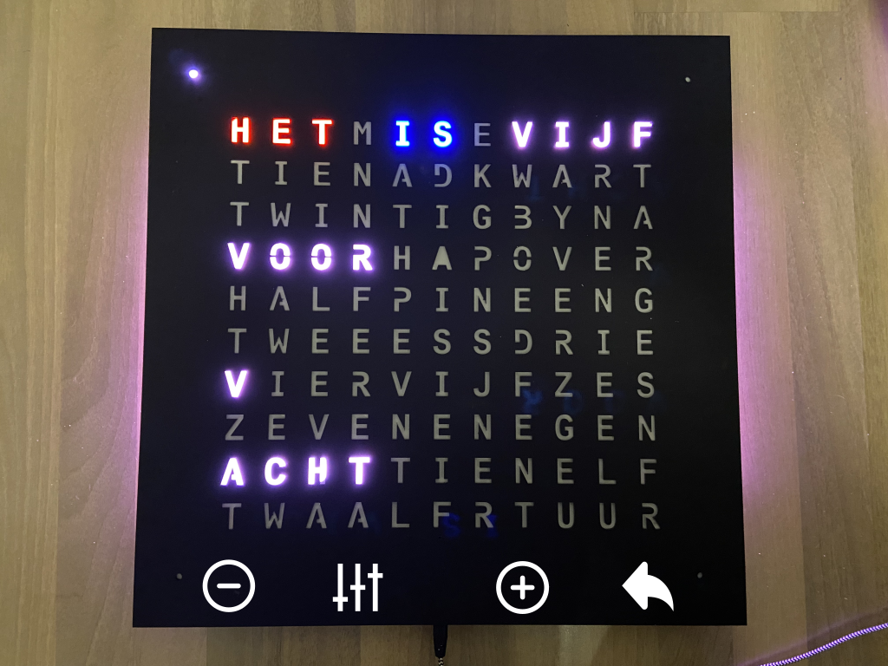

# Clock mode

When you enter the clock mode, "het is" is displayed in red and blue (or starts blinking if you have a prototype).

Depending on the mode, the hour, the five minutes or the minute dots start blinking.

| | |
| -- | -- |
|  | &bull; Tap to decrease hour/5 minutes/minute dots |
|  | &bull; Tap to cycle through hour/5 minutes/minute dots Auto/High/Low brightness    &bull; Hold to reset seconds |
|  | &bull; Tap to increase hour/5 minutes/minute dots  |
|  | &bull; Hold to return to [main mode](main.md) |

