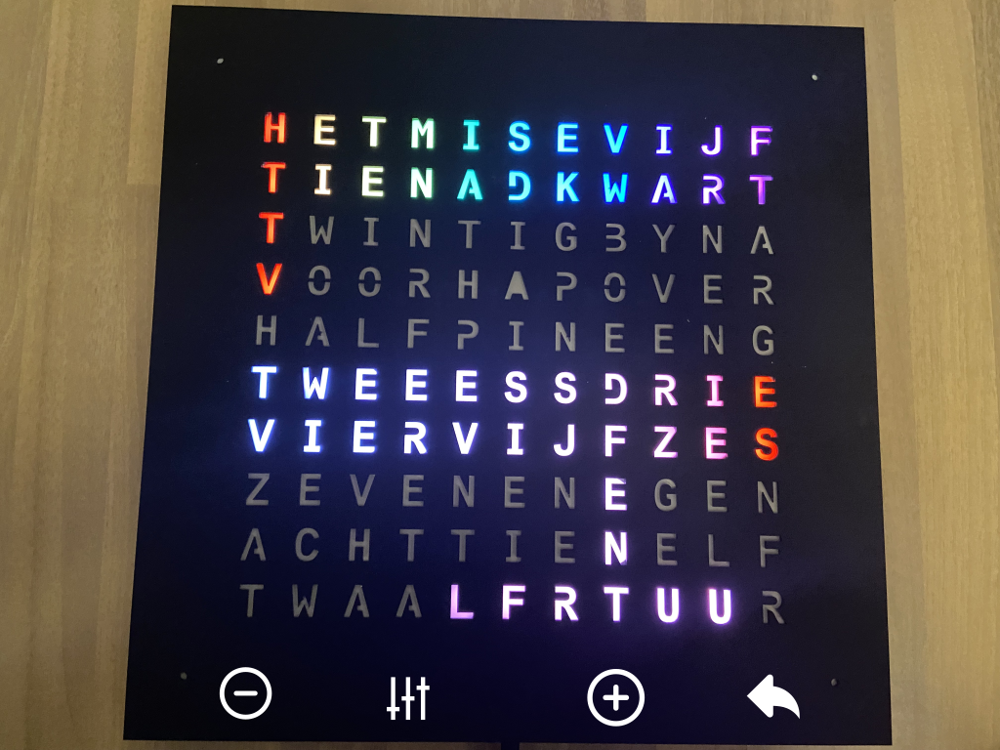
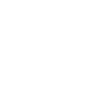

# Colour mode

Colour mode looks like this

You can set the [hue](https://en.wikipedia.org/wiki/Hue) and the [saturation](https://en.wikipedia.org/wiki/HSL_and_HSV) of the leds.
The brightness is controlled in the [brightness mode](brightness.md).

| | |
| -- | -- |
|  | &bull; Tap to decrease hue/saturation |
|  | &bull; Tap to toggle between hue and saturation |
|  | &bull; Tap to increase hue/saturation |
|  | &bull; Hold to return to [main mode](main.md) |
