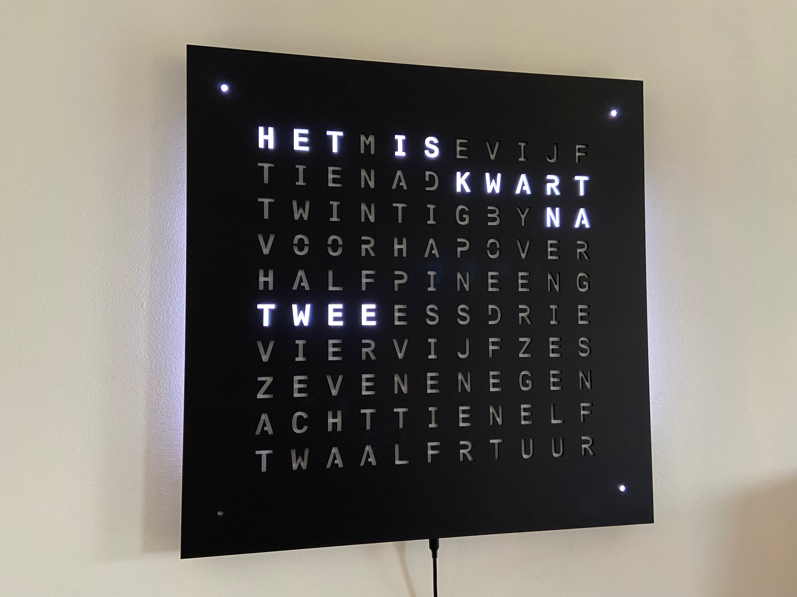
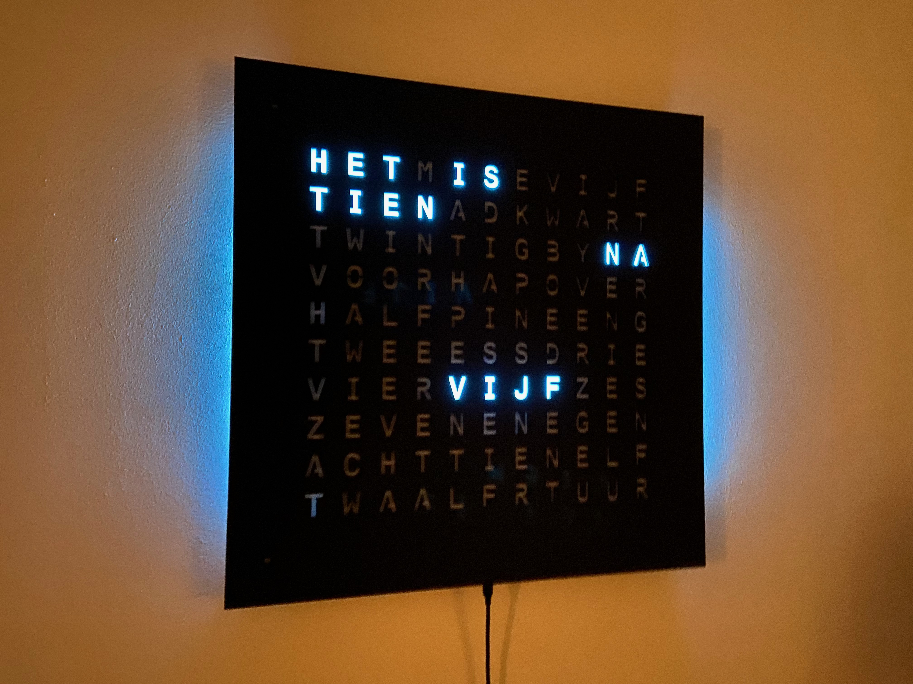

# NeoWordClock

The 50x50cm NeoWordClock is mounted on the wall like a picture and is currently only available in Dutch.

The dots show the minutes be

## Unique Features

### Coloured Letters

It is possible to change the colour of the letters and set the mood of the clock.

<video width="320" height="240" controls>
  <source src="videos/NeoWordClock.mp4" type="video/mp4">
</video>

### Backlight

The backlight of the clock creates the correct ambiance in your room.

### Seconds

Seconds can be displayed as a moving letter. This turns the clock into the ultimate device in times where every second matters.

## Colors

Currently only available in acrylic matt black.

Other colours are available and a variety of wooden fronts is also possible.
