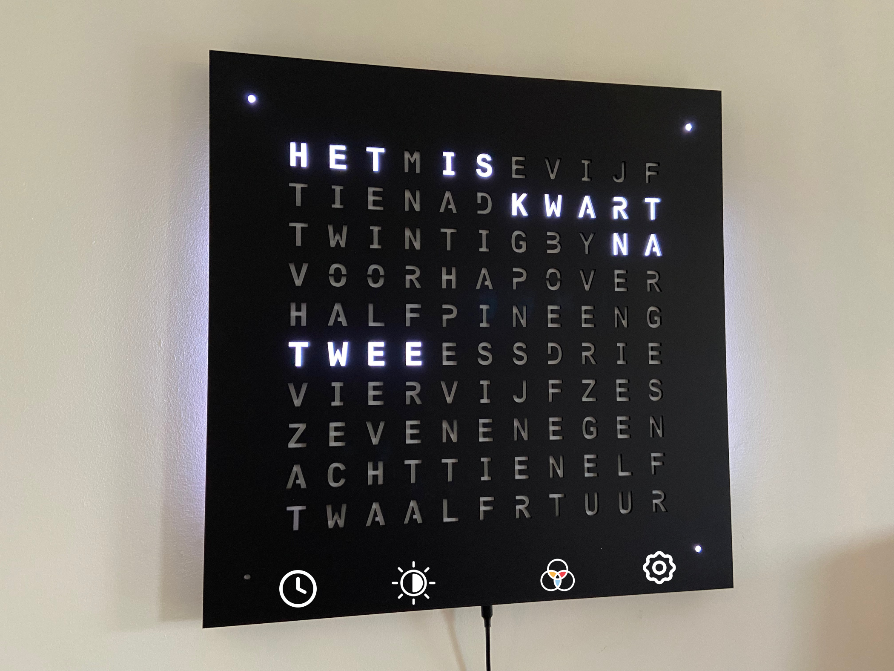

# Main mode

When booting the clock, all letters will be displayed in rainbow colors. At the bottom of the clock, you find 4 zones to set and configure the clock.

It is important that you do not touch the capacitive zones at the bottom of the clock when the clock initializes. If the clock behaves weird, unplug the power and repower the clock to reset these capacitive zones.

| | |
| -- | -- |
|  | &bull; Tap to toggle seconds on/off    &bull; Hold to enter clock mode  |
|  | &bull; Tap to toggle Auto/High/Low brightness    &bull; Hold to enter brightness mode |
|  | &bull; Tap to cycle colours    &bull;  Hold to configure your colour  |
|  | &bull; Tap to see a surprise    &bull; Hold to configure the clock  |

