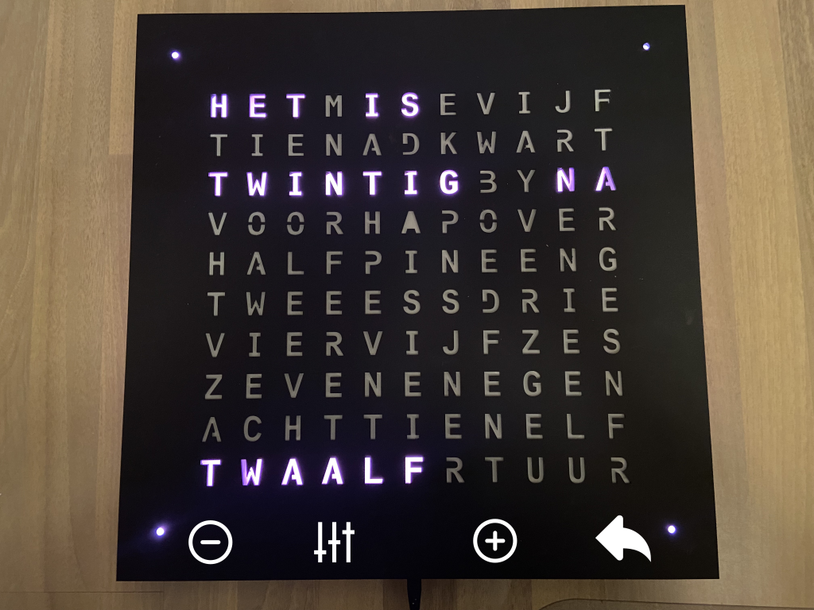

# Settings mode

In settings mode, the clock is temporarily set to 12:20 or 12:40.

| | |
| -- | -- |
|  | &bull; Tap to toggle the display of "Het is"   &bull; Hold to toggle the display of the minute dots |
|  | &bull; Tap to toggle between "over" and "na"   &bull; Hold to toggle between "twintig over/na/voor" and "tien voor/over/na half" |
|  | &bull; Tap to switch the backlight on or off   &bull; Tap to switch between normal or faded transition |
|  | &bull; Hold to return to [main mode](main.md) |
