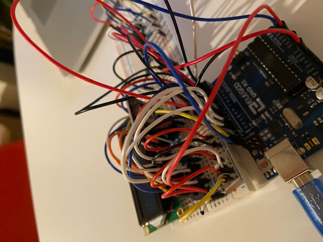
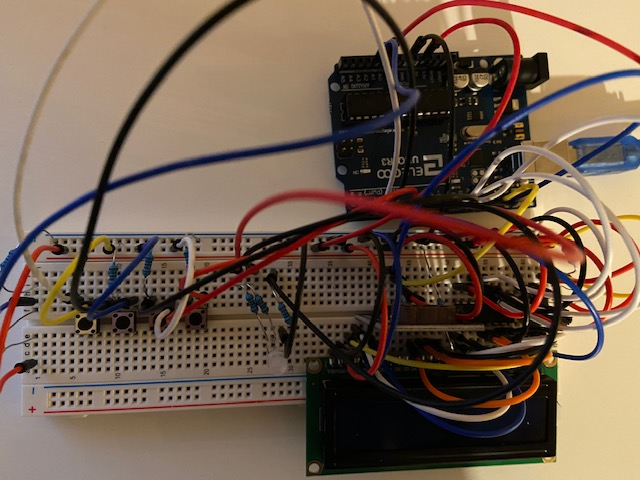
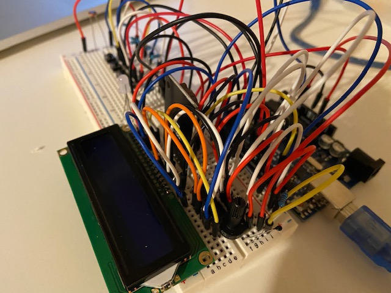
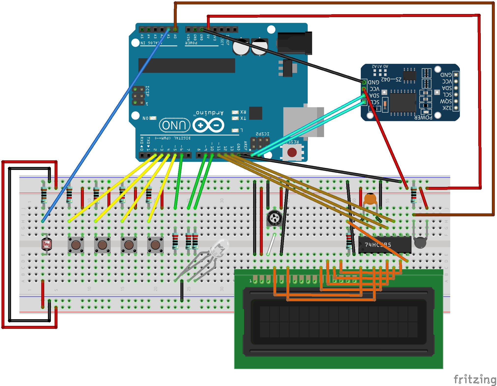

# Prototype

The first protoype I have built was based on the following lessons of the [ELEGOO UNO R3 Super Starter kit](https://www.elegoo.com/collections/uno-r3-starter-kits/products/elegoo-uno-project-super-starter-kit):
- Lesson 0: Installing IDE
- Lesson 1: Add Libraries and Open Serial Monitor
- Lesson 2: Blink
- Lesson 4: RGB LED
- Lesson 5: Digital Inputs
- Lesson 19: Real Time Clock Module
- Lesson 22: LCD Display
- Lesson 23: Thermometer
- Lesson 26: Photocell

with the addition of the [LiquidCrystal_74HC595](https://github.com/matmunk/LiquidCrystal_74HC595) and the [AceButton](https://github.com/bxparks/AceButton) libraries.
This LiquidCrystal_74HC595 library was needed because there were not enough pins to continue the prototype.

I am not proud of the code in the prototype, but is shows that the application is on the right track.
Here are some design decisions:
- 4 buttons based on the original [QlockTwo](https://qlocktwo.com/eu/qlocktwo-classic)
- Temperature sensor based on [Word Clock - Youtube](https://www.youtube.com/watch?v=yctfqg6UF1c)
- Ambient light sensor 
- RGB Led

I will probably ditch the temperature sensor, because it's a clock not a thermometer, and I will try to reduce the number of buttons to 3 while keeping the user interface intuitive.

I recreated all tutorials in the [Arduino IDE](https://www.arduino.cc/en/software). Since I missed code completion, I will be looking into something better for the [user interface design](user_interface/userinterface.md).

The images look quite impressive (my opinion)

so I decided to also provide the schematics. Other projects are already using [Fritzing](https://fritzing.org/), but the site "forced" me to pay for the software. Fortunately, you can sign up for an account first, after which you can download the program for free (thanks [Fabian](https://blog.spaps.de/download-fritzing-for-free-with-out-donation/)).

